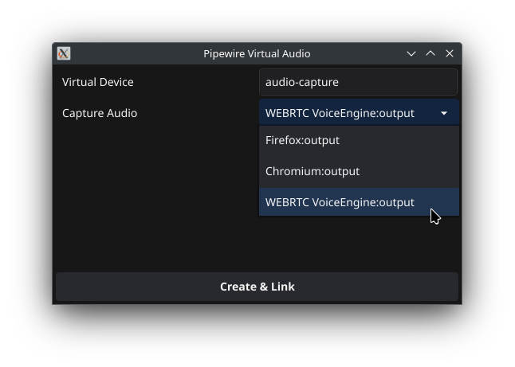

# Pipewire Virtual Audio GUI


This is a barebones interface to roughly the following commands:

```
# 1. create virtual microphone
pactl load-module module-null-sink media.class=Audio/Source/Virtual sink_name=my-virtualmic channel_map=front-left,front-right

# 2. get list of current audio outputs
pw-link -o

# 3. link the audio output to the virtual mic (stereo)
pw-link WEBRTC\ VoiceEngine:output_FL my-virtualmic:input_FL
pw-link WEBRTC\ VoiceEngine:output_FR my-virtualmic:input_FR
```

It tidies up the list of potential audio to capture and allows you to name your virtual microphone. It cleans up after itself on close.